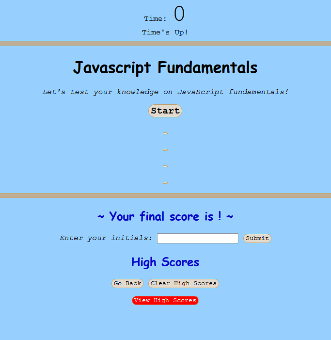

# Timed-quiz

by Lisa Le

Test your knowledge about Javascript with this short timed quiz. The user will have 60 seconds to answer 10 questions about Javascript. Each time the user gets a questions wrong, 10 seconds will be deducted from the current time. The correct answer will be displayed for each question after being answered. The final score will be given at the end, and the user will be able to save their score.

<h2> Technologies Used </h2>

    -HTML
    -CSS
    -Javascript

<h2> Requirements for Application </h2>

    -Quiz must have a start button to initiate quiz
    -Timer will start and questions will appear when "Start" is clicked
    -Time will be deducted from timer if answer is incorrect
    -Ability to save results after game has ended

<h2> Deploy Link </h2>

[Deploy Link](https://lisatle.github.io/Timed-quiz/)

<h2> Screenshots </h2>

